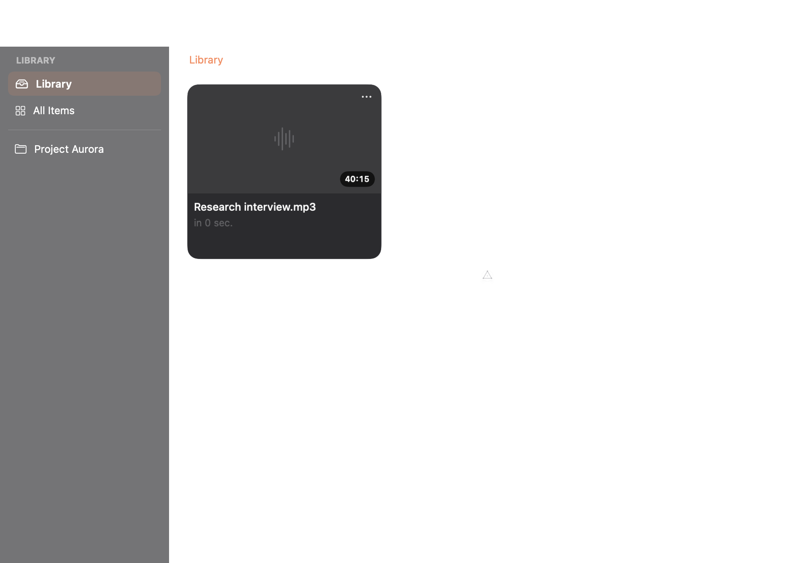
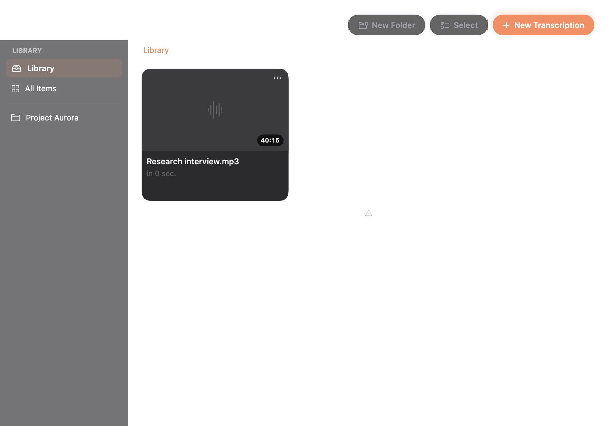
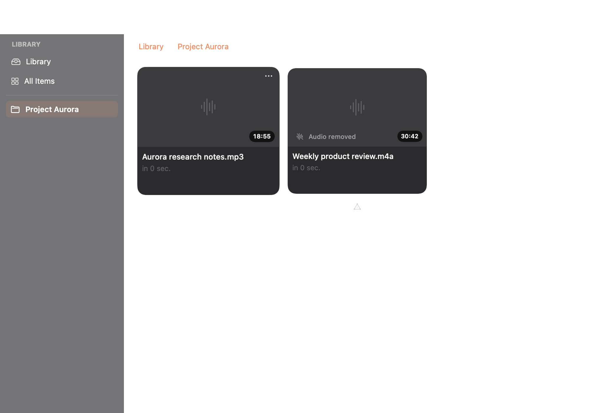
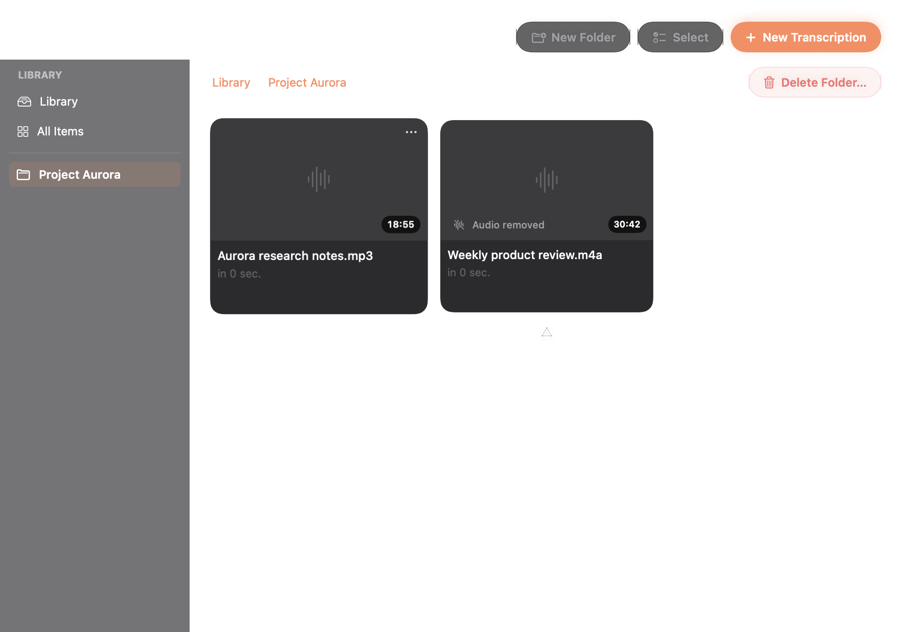
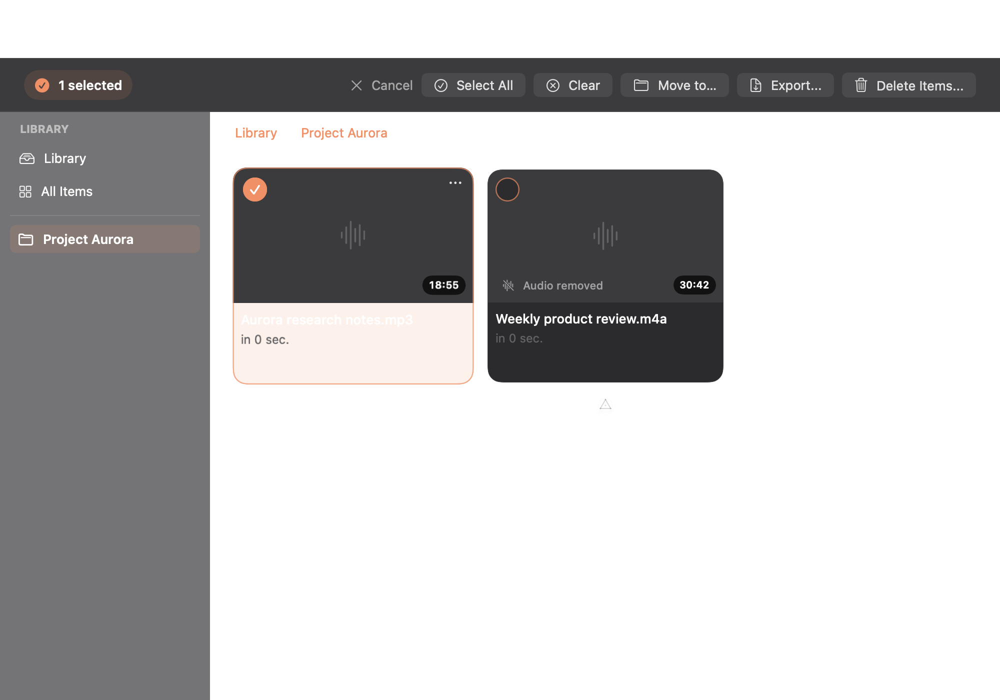
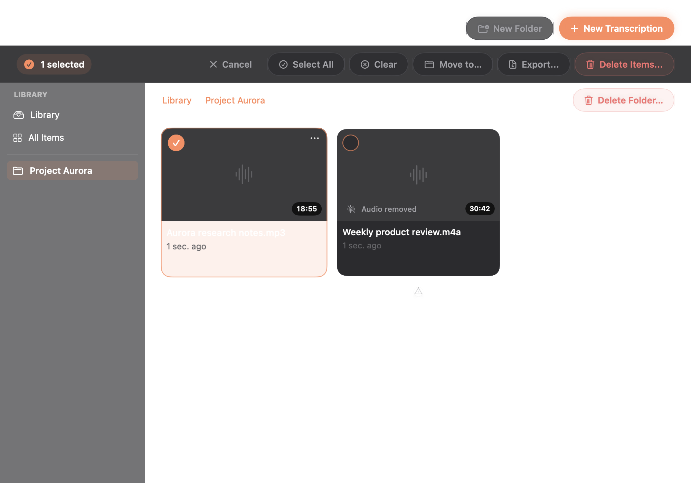

# Ticket 043: Library header visual evidence

These images render the production `TranscriptionLibraryView` at 1000 × 700
with an isolated in-memory database. No user Library data is used or changed.
The “before” images use the merged PR #46 code. The “after” images use this
change. Both sets use the same repository-backed fixture: two recordings are
saved, moved into `Project Aurora` through `moveToLibraryFolder`, and loaded
before capture. Selection mode starts with one of those two recordings selected,
so enabled and disabled action states are visible.

> The AppKit snapshot path does not composite the native root-header and
> Delete Folder button labels in the before images. Their white native control
> bounds still show the rejected small sizing. This is a snapshot limitation,
> not evidence of a production rendering defect. The before selection controls
> and all after controls are legible; the after nested-folder image provides the
> legible Delete Folder evidence.

## Root

| Before (PR #46) | After |
| --- | --- |
|  |  |

## Nested folder

| Before (PR #46) | After |
| --- | --- |
|  |  |

## Selection mode

| Before (PR #46) | After |
| --- | --- |
|  |  |

Regenerate the after images with:

```bash
LIBRARY_HEADER_EVIDENCE_DIR=/tmp/library-header-after \
  swift test --filter LibraryHeaderVisualEvidenceTests/testRenderEvidence
```
