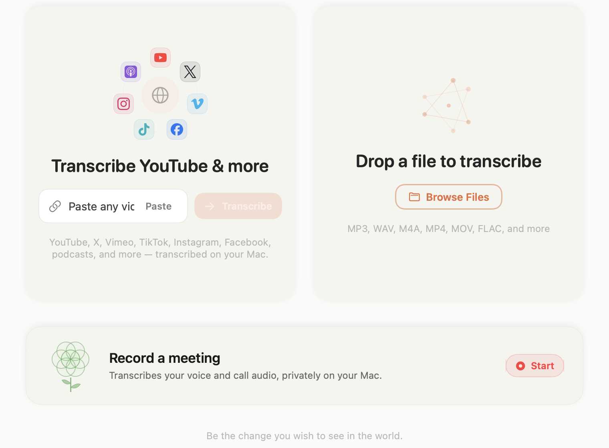
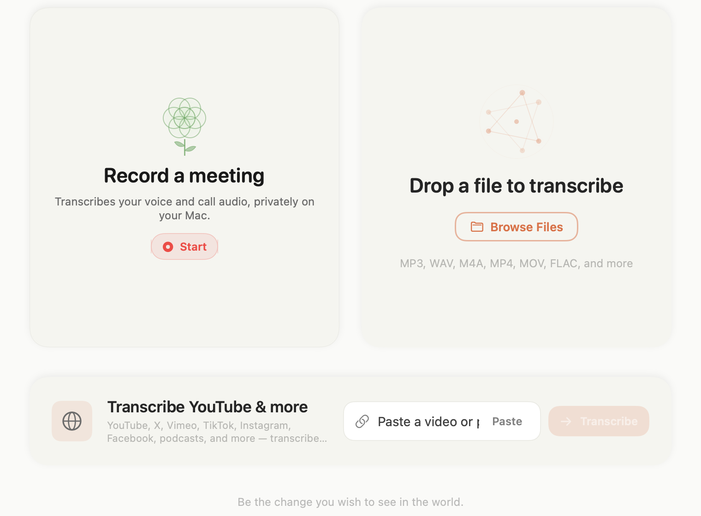

# Ticket 044 visual evidence

Rendered from `TranscribeView` in light mode at a 760 × 560 point detail-area viewport. The images use the same SwiftUI view and view models as the app.

| Before | After |
| --- | --- |
|  |  |

The after view keeps the meeting Start action, file Browse action, media URL field, Paste action, and Transcribe action visible. Please confirm visual approval before merge.
