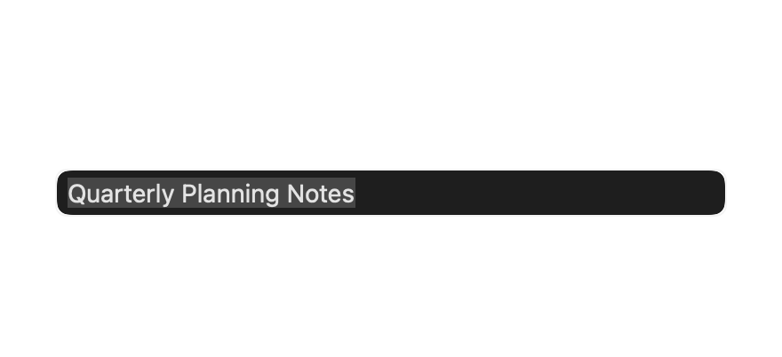

# Ticket 045 visual evidence

Rendered from the production `LibraryNewFolderDialog` at its 440pt dialog width. The nested-folder destination and a typical multiword folder name show the available field size. The selected text and insertion caret show that the name field has initial keyboard focus.



> The AppKit bitmap path does not composite the native button labels. Their white native control bounds are visible. This is a snapshot limitation; the production buttons are Cancel and Create.

Please confirm visual approval before merge.

Regenerate with:

```bash
NEW_FOLDER_DIALOG_EVIDENCE_DIR="$PWD/docs/visual-evidence/ticket-045" \
  swift test --filter LibraryNewFolderDialogTests/testRenderEvidence
```
