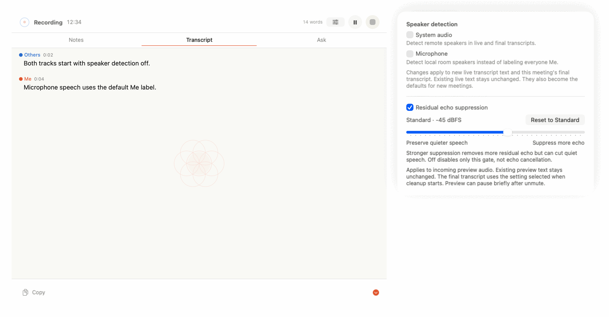
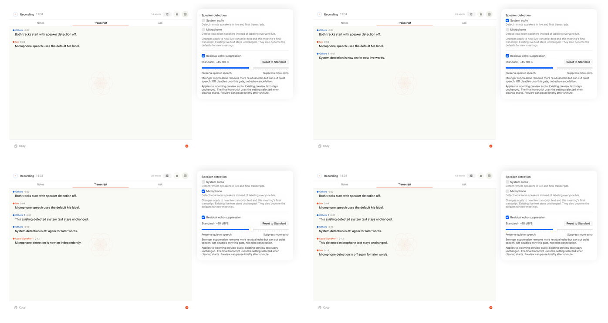

# Ticket 046 visual evidence

Rendered in light mode from the real `MeetingRecordingPanelView` and its in-progress audio-controls content at the panel's established 420-point width.

The sliders button keeps the existing secondary-action size and placement. Both capture tracks are named directly. A track that is not recorded stays visible but disabled with an explanation. Successful changes apply to later live transcript updates and the final transcript, and become defaults for new meetings. Already displayed live words keep their attribution.

## Live ON/OFF interaction

The animation and the static sequence below use the real meeting panel and in-progress audio-controls views. They show these independent transitions during one ongoing meeting:

1. Both tracks start off: system words use **Others** and microphone words use **Me**.
2. System detection turns on while microphone stays off: later system words get a detected **Others 1** label.
3. System turns off and microphone turns on: the earlier detected system line stays unchanged, later system words return to **Others**, and later microphone words get **Local Speaker 1**.
4. Microphone turns off: its earlier detected line stays unchanged and later microphone words return to **Me**.

Automated live-capture evidence is in `MeetingRecordingServiceTests.testLivePreviewAppliesLatestSpeakerDetectionIndependentlyByTrack`: it switches system detection on while microphone detection stays off, then switches system off and microphone on. Later live words retain the correct independent attribution. `testLivePreviewDiscardsStaleInFlightDiarizationAfterDetectionTurnsOff` verifies that a delayed result cannot restore old attribution. `MeetingTranscriptAssemblerTests.testIndependentLiveDiarizationCallsDoNotReuseLocalSpeakerIdentity` verifies that separate diarization calls cannot collide on their local `S1` index when there is no cross-chunk matching evidence.

Please confirm visual approval before merge.
