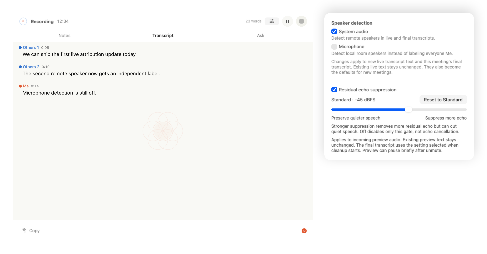

# Ticket 046 visual evidence

Rendered in light mode from the real `MeetingRecordingPanelView` and its in-progress audio-controls content at the panel's established 420-point width.

The sliders button keeps the existing secondary-action size and placement. Both capture tracks are named directly. A track that is not recorded stays visible but disabled with an explanation. Successful changes apply to later live transcript updates and the final transcript, and become defaults for new meetings. Already displayed live words keep their attribution.

Automated live-capture evidence is in `MeetingRecordingServiceTests.testLivePreviewAppliesLatestSpeakerDetectionIndependentlyByTrack`: it switches system detection on while microphone detection stays off, then switches system off and microphone on. Later live words retain the correct independent attribution. `testLivePreviewDiscardsStaleInFlightDiarizationAfterDetectionTurnsOff` verifies that a delayed result cannot restore old attribution.

Please confirm visual approval before merge.
